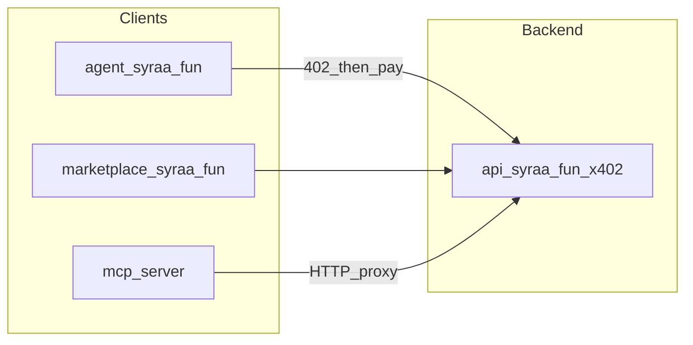

<div align="center">


# **Syra**

### Machine Money for Agents

[](LICENSE)
[](https://docs.syraa.fun)
[](https://syraa.fun/marketplace)

**[Documentation](https://docs.syraa.fun)** · **[API Marketplace](https://syraa.fun/marketplace)** · **[Agent demo](https://syraa.fun)** · **[X (Twitter)](https://x.com/syra_agent)**

</div>

---

## What Is Syra?

**Syra** is **machine money for agents** on Solana — organized around five pillars: **Earn**, **Treasury**, **Invest**, **Spend**, and **Grow**. Wealth is the narrative; x402 is one module (Spend), not the whole story.

| Pillar | Purpose |
|--------|---------|
| **Earn** | Agents monetize skills (prompts, KOL, creator attribution) |
| **Treasury** | Allocate and manage capital (wallets, billing, policy) |
| **Invest** | Deploy capital autonomously (Giza, LP, Jupiter, RISE) |
| **Spend** | x402 native pay-per-call APIs |
| **Grow** | Yield + portfolio optimization (analysis-first) |

Discovery: `GET /pillars` on [api.syraa.fun](https://api.syraa.fun)

Integrate via **SDK** (`client.pillars`, `client.invest`, …), **MCP**, or the **API marketplace** at [syraa.fun/marketplace](https://syraa.fun/marketplace). The web chat agent is a reference client — the product is machine money for agents.

**Ecosystem:** [S3 Labs](https://s3labs.xyz) (Syra-backed growth studio for Solana developers) and [Up Only Fund](https://uponlyfund.com) (Syra-backed onchain allocator) ship as sibling brands on the same rails.

**Notice:** x402 becomes one module (Spend). Payments become one feature. Wealth becomes the narrative.

---

## Capabilities at a Glance

| Section | Description |
|--------|-------------|
| **Market Overview** | Price, volume, volatility, trend strength |
| **Technical Indicators** | RSI, MACD, SMA, EMA, Bollinger Bands |
| **Action Perspectives** | Key levels, momentum bias, scenario outlooks |
| **Risk Context** | R/R awareness and exposure considerations |
| **AI Insights** | Confidence levels and sentiment interpretation |

---

## Where Syra Runs

| Platform | Description |
|----------|-------------|
| **x402 Autonomous Agent** | Research & insights workflows on x402scan |
| **Telegram Bot** | Chat-based access to market analysis and insights |
| **API & Workflows** | Integrates with n8n and automation pipelines |
| **Data & Signal Engine** | Indicators, trends, and on-chain movements |
| **AI Reasoning Layer** | Synthesizes signals into structured interpretations |

---

## Quick Start

### MCP (Cursor / Claude Code) — one line

```bash
claude mcp add syra -- npx -y @syra-ai/mcp-server@latest
```

Set `SYRA_API_BASE_URL=https://api.syraa.fun`. For auto-pay, set `SYRA_PAYER_KEYPAIR` (Solana USDC wallet).

**Public metrics:** [syraa.fun/metrics](https://syraa.fun/metrics) · **Reference agent:** [syraa.fun/reference/scalper](https://syraa.fun/reference/scalper) · **Agent docs:** [api.syraa.fun/llms-full.txt](https://api.syraa.fun/llms-full.txt)

### Telegram Bot

1. Open [Syra Trading Agent Bot](https://t.me/syra_trading_bot)
2. Press **Start**
3. Use `/list` to view supported tokens
4. Try `/signal bitcoin` for a live analysis

**Example commands**

| Command | Description |
|---------|-------------|
| `/start` | View available commands |
| `/signal bitcoin` | Get latest BTC trading analysis |
| `/list` | Show supported tokens |
| `/news BTC` | Get latest BTC-related news |
| `/top_mention today` | Most-discussed tokens today |
| `/docs` | Open documentation |
| `/feedback` | Send suggestions or issues |

### x402 Autonomous Agent

Syra runs as an autonomous research agent on **x402scan** for automated research cycles, news and narrative monitoring, and signal interpretation pipelines.

---

## Syra ecosystem (backed brands)

Syra is the parent **machine money** infrastructure. These programs ship on Syra rails but maintain their own public brands:

| Brand | Site | Role |
|-------|------|------|
| **Syra** | [syraa.fun](https://syraa.fun) | Core product — agent wallets, x402 APIs, treasury, invest/spend rails |
| **S3 Labs** | [s3labs.xyz](https://s3labs.xyz) | Syra-backed growth partner for Solana developers — programs, KOL, jobs, community |
| **Up Only Fund** | [uponlyfund.com](https://uponlyfund.com) | Syra-backed onchain allocator — 80/20 mandate, RISE tooling, `$UPONLY` tranche |

---

## Repository Structure (Monorepo)

| Package | Description |
|---------|-------------|
| **`web`** | Unified Syra app — Marketplace (x402 catalog), agent wallet, dashboard, proof demos |
| **`api`** | Backend API — machine money for agents: x402 APIs, agent wallets, policy engine, S3 Labs + UOF routes |
| **`syra-sdk`** | Typed `@syra-ai/sdk` client for x402 API integration |
| **`mcp-server`** | MCP server — `claude mcp add syra -- npx -y @syra-ai/mcp-server@latest` |
| **`packages/syra-x402-payer`** | MIT `@syra-ai/x402-payer` — x402 sign/retry helper |
| **`documentation`** | Docs site (docs.syraa.fun) |
| **`landing`** | Marketing landing site (syraa.fun) |
| **`s3labs`** | S3 Labs web app — growth programs, KOL marketplace, jobs, community ([s3labs README](./s3labs/README.md)) |
| **`uponly-fund`** | Up Only Fund — Syra-backed allocator brand, mandate site, RISE command dashboard ([UOF README](./uponly-fund/README.md)) |
| **`services/bnb-agent`** | BNB Chain ERC-8183 sidecar (Python) for multi-chain agent jobs |

---

## Colosseum Frontier — hackathon submission

**Hero product (what to demo):** [`api`](./api) + [`web`](./web) — the **Syra rail**: machine money for agents (x402 APIs + agent wallets + treasury). Treat **S3 Labs**, **Up Only Fund**, and the chat reference agent as **Syra-backed proof surfaces**, not equal demo time to the core rail.

### Golden path (live)

1. Open **[syraa.fun/marketplace](https://syraa.fun/marketplace)** → connect wallet → try a paid x402 route.
2. Integrate via **`@syra-ai/sdk`** or **`@syra-ai/mcp-server`** (see [syra-sdk](./syra-sdk) and [mcp-server](./mcp-server)).
3. Fund **[syraa.fun/wallet](https://syraa.fun/wallet)** → view spend dashboard and policy caps.
4. Discovery: **[api.syraa.fun](https://api.syraa.fun)** — `/.well-known/x402`, `/openapi.json` (see [api README](./api/README.md)).

### Architecture (hero stack)



### Traction KPIs (publish these in deck and social)

Aligned with [Superteam grant milestones](./superteam/README.md):

| Metric | Target |
|--------|--------|
| Paid API calls (cumulative) | **500** |
| Agent chat sessions with paid tool use | **200** |

**Public snapshot:** [syraa.fun/analytics](https://syraa.fun/analytics) — update weekly through the hackathon window.

### Production Solana RPC (Helius-class)

The API **must** use an RPC that allows **`getAccountInfo`** and full blockchain reads (8004 registry, agent tooling). Many read-only keys return 403. Set in **`api/.env`** (see [api `.env.example`](./api/.env.example)):

- `SOLANA_RPC_URL` — primary (recommended: **Helius** mainnet URL with API key).
- Optional split: `SOLANA_RPC_8004_URL` or `SOLANA_RPC_BLOCKCHAIN_URL` if you isolate 8004 traffic.

**Verify after deploy:** one paid agent tool, `GET /8004/agent/<ASSET>/liveness` (if registered), and `getLatestBlockhash` from the same RPC.

### Phantom-first wallet UX

- **ai-agent / marketplace:** Privy — enable **Phantom** in the Privy dashboard; fallback wallet order prefers **Phantom** before MetaMask for Solana flows.
- **prediction-game:** `@solana/wallet-adapter` — **Phantom** is listed first in the modal when multiple wallets are detected.

### MoonPay (fiat onramp — scoped for GTM)

**Chosen over Squads for this plan** to answer “how users fund USDC for x402.” Squads remains a strong follow-on for **treasury multisig** once ops scale.

**Integration steps (scope; requires MoonPay + Privy dashboard access):**

1. Enable **MoonPay** (or Privy **funding** / onramp) in [Privy dashboard](https://dashboard.privy.io) for your app — follow Privy docs for **Solana USDC** or **Base USDC** funding, matching the chain your demo uses.
2. Add a single CTA in the agent app near **Connect / Fund agent wallet** (e.g. link to Privy funding UI or MoonPay widget) with UTM params for attribution.
3. Document in your deck: **fiat → stablecoin → x402 call** in under 2 minutes (record once MoonPay is live).
4. Do **not** commit API secrets; use env vars and server-side session only per MoonPay/Privy requirements.

### Deferred (stay honest in pitch)

- **$SYRA staking → x402 discount** is **roadmap** until wired into API pricing (see [tokenomics](./documentation/src/data/tokenomicsV2.md)).
- **MCP + automated x402 signing** — shipped in `@syra-ai/mcp-server@0.4.1` via `SYRA_PAYER_KEYPAIR` and MCP bridge for agent-direct tools.

---

## Why Syra?

- **AI-assisted insights** — Multiple indicators and reasoning combined into structured trade outlooks  
- **Real-time market data** — Powered by live technical and contextual sources  
- **Research-driven output** — Focused on understanding, not blind execution  
- **Multi-platform access** — Telegram, x402 Agent, and automation workflows  
- **Educational context** — Every output includes explanations and indicator context  
- **Agentic automation** — Analysis pipelines that run across platforms  

Syra is built for **clarity**, **consistency**, and **structured reasoning**. It blends AI insight with traditional market analysis and is designed for automation and agent workflows. It is not built to replace decision-making—it is built to **enhance understanding**.

---

## Documentation

Full documentation (welcome, API reference, Syra Agent, x402 agent, tokenomics) lives in the **`documentation`** app and is published at **[docs.syraa.fun](https://docs.syraa.fun)**.

| Resource | URL |
|----------|-----|
| Syra docs | [docs.syraa.fun](https://docs.syraa.fun) |
| API gateway | [api.syraa.fun](https://api.syraa.fun) |
| Marketplace | [syraa.fun/marketplace](https://syraa.fun/marketplace) |
| S3 Labs | [s3labs.xyz](https://s3labs.xyz) |
| Up Only Fund | [uponlyfund.com](https://uponlyfund.com) |

- **Local:** `cd documentation && npm install && npm run dev`  
- **Entry route:** `/docs/welcome` (or open `/docs` for the docs home)

---

## License

This project is open source under the [MIT License](LICENSE).
