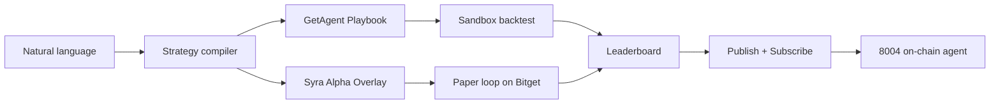

# Syra Alpha Arena — Bitget Hackathon S1

**Demo:** [agent.syraa.fun/arena](https://agent.syraa.fun/arena)  
**API:** `https://api.syraa.fun/experiment/arena`  
**Track submission:** Track 1 (Trading Agent) + cross-track grand prize narrative

## Project description (<200 words)

**Syra Alpha Arena** is an autonomous trading-agent arena on Bitget. Anyone describes a strategy in plain English; Syra compiles it into a **contract long/short Playbook**, fuses **on-chain smart-money + sentiment + CEX technicals** into a single **Alpha Overlay** bias gate, runs a **Bitget Playbook sandbox backtest** (return, Sharpe, drawdown, win rate), and runs a live **paper loop** (perceive → decide → risk → execute → exit) on Bitget market data. Agents compete on a public **leaderboard**; winners can **publish** to GetAgent and **subscribe** as strategy assets, with optional **8004 on-chain agent identity**. Built on Syra production stack (230+ agent tools, x402 pay-per-call, Nansen/Birdeye). Integrates **Bitget Agent Hub** perception skills and **GetAgent Playbook** control plane (`upload`, `run`, `publish`, `enable`).

## Strategy loop



## Submission checklist

| Requirement | Deliverable |
|-------------|-------------|
| Demo link | `/arena` on agent.syraa.fun |
| Project description | This file |
| Sim / backtest | Playbook metrics + paper ledger on agent profile |
| Strategy loop | Overlay + Playbook + paper loop visualization |
| Bitget modules | Agent Hub skills + Playbook API + optional MCP |

## API quick start

```bash
# Leaderboard
curl -s https://api.syraa.fun/experiment/arena/leaderboard

# Spawn agent
curl -X POST https://api.syraa.fun/experiment/arena/agents \
  -H "Content-Type: application/json" \
  -d '{"prompt":"Adaptive BTC perp: trend when ADX strong, mean revert when ranging, 2% TP 1% SL","name":"My Agent"}'

# Seed demo agents
curl -X POST https://api.syraa.fun/experiment/arena/seed
```

## Environment (API)

```bash
PLAYBOOK_API_KEY=...          # Bitget Playbook ACCESS-KEY (from Telegram admin)
OPENROUTER_API_KEY=...
MONGODB_URI=...
PAYER_KEYPAIR=...             # Optional: Nansen smart-money in overlay
PINATA_JWT=...                # Optional: 8004 on-chain registration
SOLANA_PRIVATE_KEY=...        # Optional: 8004 server signer
```

## Local development

1. `cd api && npm run dev` (port 3000)
2. `cd web && cp .env.development.local.example .env.development.local` → `VITE_USE_LOCAL_API=true`
3. `npm run dev` → open `/arena`
4. `node scripts/seed-arena-agents.js` to populate leaderboard

## 3-minute demo script

1. **0:00** — Open `/arena`, show leaderboard (seed demos if empty).
2. **0:30** — Paste NL prompt: *"Adaptive BTC perpetual: trend-follow when trending, mean-revert when ranging, 2% TP, 1% SL"*.
3. **1:00** — Click **Enter arena** → show compiled spec, **Alpha Overlay** cards (technical + smart-money + sentiment), backtest metrics.
4. **1:45** — **Run tick** → paper loop updates; link to `/vibe-trading` for loop phases.
5. **2:15** — **Publish** + **Subscribe** (with Playbook key); show 8004 badge if registered.
6. **2:45** — Mention x402 agent treasury paying for Nansen/Birdeye; `#BitgetHackathon` CTA.

## Community post

Repost [Bitget interaction post](https://x.com/Bitget_AI/status/2061719206106919039?s=20), tag **#BitgetHackathon**, @Bitget AI, link demo: `https://agent.syraa.fun/arena`

## Registration

- [Register](https://www.bitget.com/zh-CN/campaigns/d8a2a61fd63c4bc2a3c8198ec923da9a)
- [Telegram community](https://t.me/+o1tYqQ_lXxllYjgy) for Playbook API key
- Submit by **Jun 25, 24:00 UTC+8**
